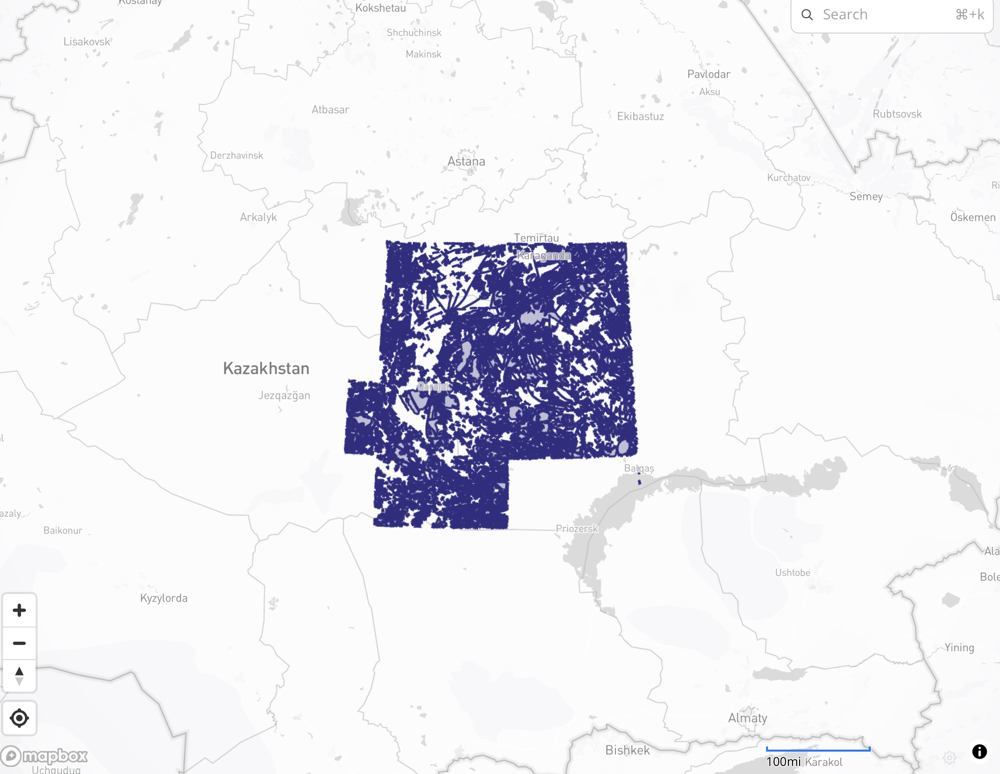

# TerraSoviet Data Rescue — Трек 2: Векторизация карт

Автоматизированный пайплайн для векторизации советских структурно-формационных карт.  
**Вход:** растровое изображение карты + легенды + советские номенклатурные листы.  
**Выход:** GeoJSON и Shapefile с геологическими полигонами, разбитыми по листам 1:100 000.



---

## Вход и выход

### Что подаётся на вход
| Файл | Описание |
|---|---|
| `--map` | Растровое изображение карты (.jpg / .png). Например, Структурно-Формационная схема 1:500 000 |
| `--legend` | Растровое изображение легенды (условные обозначения) — отдельный файл |
| `--sheets` | Советские номенклатурные листы через запятую: `M-43-В,M-42-Г,L-43-А,L-42-Б` — задают координаты bbox карты |
| `--output` | Папка куда сохраняются все результаты |

### Что получается на выходе
После запуска в папке `--output` появляются:

| Файл | Описание |
|---|---|
| `output/combined.geojson` | Все геологические полигоны в одном GeoJSON (4079 объектов для тестовой карты) |
| `output/combined.shp` | То же самое в формате Shapefile (ESRI) |
| `tiles/<лист>.geojson` | Полигоны разбитые по советским листам 1:100 000 (144 файла) |
| `debug/border_detection.jpg` | Визуализация найденной границы карты |
| `debug/tiles_grid.jpg` | Сетка тайлов поверх карты |
| `debug/label_map.jpg` | Карта раскрашенная по формациям |
| `debug/legend_preview.jpg` | Найденные свотчи легенды |

Каждый полигон в GeoJSON содержит:
```json
{
  "formation": "Гранитовая",   // название формации из легенды
  "color_hex": "#e8c4a0",      // цвет свотча
  "sheet": "M-43-97"           // советский лист 1:100 000
}
```

---

## Быстрый старт

> Требуется **Python 3.11**

```bash
pip install -r requirements.txt
```

Листы можно передать строкой или через JSON-файл:

```bash
# строкой
python main.py --sheets "M-43-В,M-42-Г,L-43-А,L-42-Б" ...

# через файл (data/sheets.json уже лежит в репо для тестовой карты)
python main.py --sheets data/sheets.json ...
```

---

### Режим 1 — Интерактивный кроп (по умолчанию)

Открывает окно с картой — кликаешь углы по периметру (обходя врезки и легенду), закрываешь окно. Точки сохраняются в `data/polygon_points.txt` и при следующих запусках окно не открывается повторно.

```bash
python main.py \
  --map    data/map.jpg \
  --legend data/legenda.jpg \
  --sheets "M-43-В,M-42-Г,L-43-А,L-42-Б" \
  --output results/
```

> Чтобы перерисовать границу — удали `data/polygon_points.txt` и запусти снова.

### Режим 2 — Автоматический (`--no-crop`)

Граница определяется автоматически по яркостному профилю. Не требует дисплея — подходит для серверов.

```bash
python main.py \
  --map    data/map.jpg \
  --legend data/legenda.jpg \
  --sheets "M-43-В,M-42-Г,L-43-А,L-42-Б" \
  --output results/ \
  --no-crop
```

---

## Аргументы CLI

| Аргумент | Описание |
|---|---|
| `--map` | Путь к растровой карте (.jpg / .png) |
| `--legend` | Путь к легенде (отдельный файл) |
| `--sheets` | Советские номенклатурные листы через запятую |
| `--output` | Папка для результатов |
| `--no-crop` | Автодетекция границы (без интерактивного окна) |

---

## Как работает пайплайн (8 шагов)

### Шаг 1 — Номенклатурные листы → координаты (`pipeline/tiling.py`)
По советским обозначениям листов (M-43-В, L-42-Б и т.д.) вычисляет bbox карты в WGS84.

### Шаг 2 — Тайловая сетка (`pipeline/tiling.py`)
Генерирует сетку советских листов 1:100 000 (20'×30') внутри bbox.  
В каждом квадранте 1:500 000 — 36 листов. Итого **144 листа**.

### Шаг 3 — Предобработка (`pipeline/preprocess.py`)
- Шумоподавление: `fastNlMeansDenoisingColored`
- Выравнивание контраста: CLAHE в LAB-пространстве
- Повышение резкости: unsharp masking

### Шаг 4 — Детекция границы карты (`pipeline/georeference.py`)
**Первый запуск:** открывает интерактивное окно, пользователь кликает углы карты по периметру (вогнутые углы, врезки обходятся). Сохраняет `data/polygon_points.txt`.  
**Следующие запуски:** читает `polygon_points.txt` напрямую.

Из полигона строится маска: всё вне карты заполняется белым, изображение обрезается по bounding rect полигона. Сохраняется `debug/border_detection.jpg` с зелёным полигоном и `debug/tiles_grid.jpg` с наложенной сеткой тайлов.

### Шаг 5 — Извлечение легенды (`pipeline/legend.py`)
- PaddleOCR читает текст в легенде
- Находит цветные прямоугольники (свотчи) слева от текста
- Сопоставляет каждый свотч с ближайшим текстовым описанием
- Извлекает медианный цвет свотча в LAB-пространстве
- Результат: список записей `{name, code, color_hex, hsv_lower, hsv_upper}`

### Шаг 6 — OCR фракций
Названия и коды формаций уже извлечены на шаге 5 внутри `legend.extract_legend()`.

### Шаг 7 — Сегментация карты (`pipeline/segment.py`)
Nearest-centroid в LAB-пространстве: каждый пиксель карты относится к ближайшей записи легенды по цветовому расстоянию.  
Фон (белая бумага, чёрные линии, серые надписи) исключается по порогам L и насыщенности.  
`findContours` → полигоны для каждой формации.

### Шаг 8 — Экспорт (`pipeline/export.py`)
- Пиксельные контуры → координаты WGS84 через аффинную матрицу `rasterio.from_bounds`
- Каждый полигон клипируется по bbox своего тайла (shapely)
- Сохраняется `combined.geojson`, `combined.shp` и отдельный `.geojson` для каждого тайла

---

## Структура результатов

```
results/
├── output/
│   ├── combined.geojson     # все полигоны
│   ├── combined.shp         # то же в Shapefile
│   └── ...
├── tiles/
│   ├── M-43-1.geojson       # полигоны по листам 1:100 000
│   ├── L-42-70.geojson
│   └── ...                  # 144 листа
└── debug/
    ├── border_detection.jpg  # зелёный полигон границы карты
    ├── tiles_grid.jpg        # сетка тайлов поверх карты
    ├── legend_preview.jpg    # найденные свотчи
    ├── segments_preview.jpg  # контуры формаций
    └── label_map.jpg         # карта раскрашенная по формациям
```

Каждый объект в GeoJSON:
```json
{
  "type": "Feature",
  "geometry": { "type": "Polygon", "coordinates": [[lon, lat], ...] },
  "properties": {
    "formation": "Гранитовая",
    "color_hex": "#e8c4a0",
    "sheet":     "M-43-97"
  }
}
```

---

## Структура репозитория

```
terrasoviet/
├── data/
│   ├── map.jpg               # карта (растр)
│   ├── legenda.jpg           # легенда
│   ├── legend_codes.json     # словарь кодов формаций
│   ├── polygon_points.txt    # точки границы карты (создаётся при первом запуске)
│   └── sam_vit_b.pth         # веса SAM (опционально)
├── main.py                   # точка входа, CLI
├── requirements.txt
└── pipeline/
    ├── georeference.py       # граница карты, геопривязка
    ├── tiling.py             # советская номенклатура
    ├── legend.py             # извлечение свотчей + OCR
    ├── segment.py            # цветовая сегментация
    ├── preprocess.py         # предобработка изображения
    └── export.py             # GeoJSON / Shapefile
```

---

## Советские листы 1:100 000

Карта покрывает 4 квадранта 1:500 000:

| Квадрант | Широта | Долгота |
|---|---|---|
| M-42-Г | 48–50°N | 69–72°E |
| M-43-В | 48–50°N | 72–75°E |
| L-42-Б | 46–48°N | 69–72°E |
| L-43-А | 46–48°N | 72–75°E |

Каждый квадрант делится на 36 листов 1:100 000 (сетка 6×6, шаг 20'×30'). Итого **144 листа**.

---

## Масштабируемость

Пайплайн универсален — не привязан к конкретной карте:

```bash
python main.py \
  --map    другая_карта.jpg \
  --legend другая_легенда.jpg \
  --sheets "N-44-А,N-43-Б" \
  --output out/
```

При смене карты удали `data/polygon_points.txt` — при следующем запуске снова откроется окно для разметки границ.
